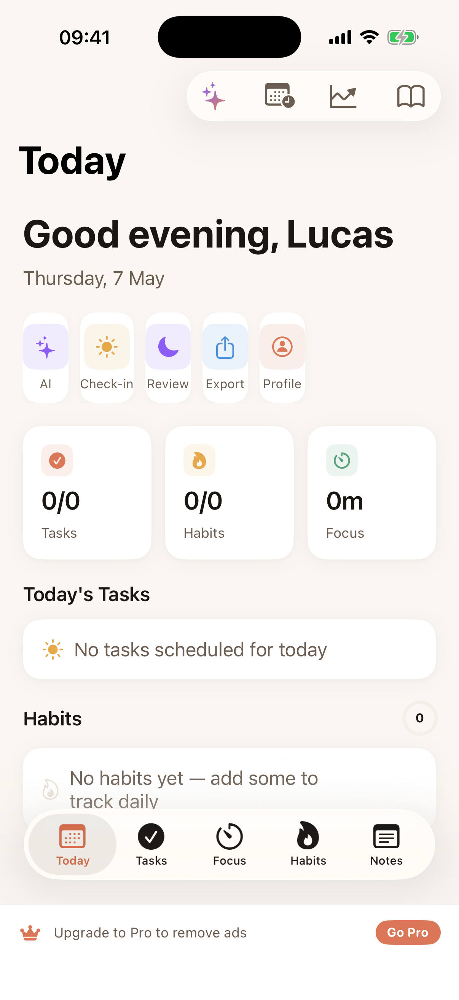
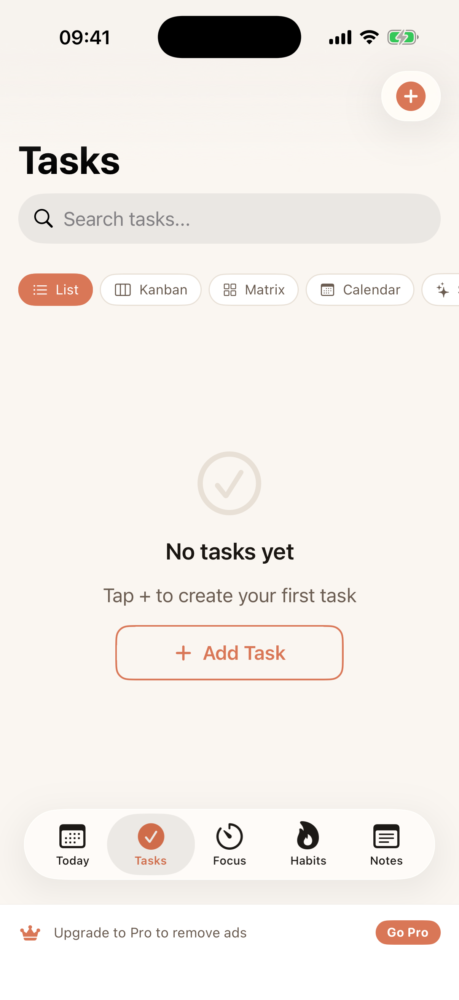
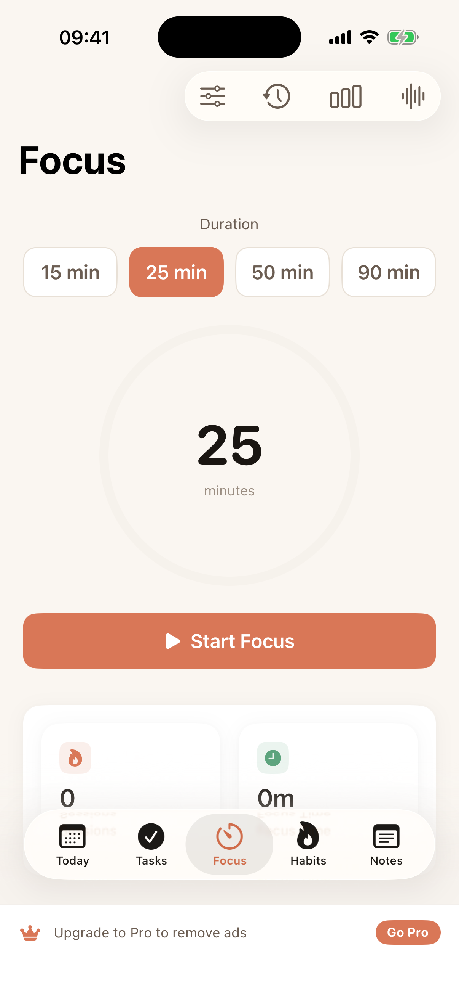
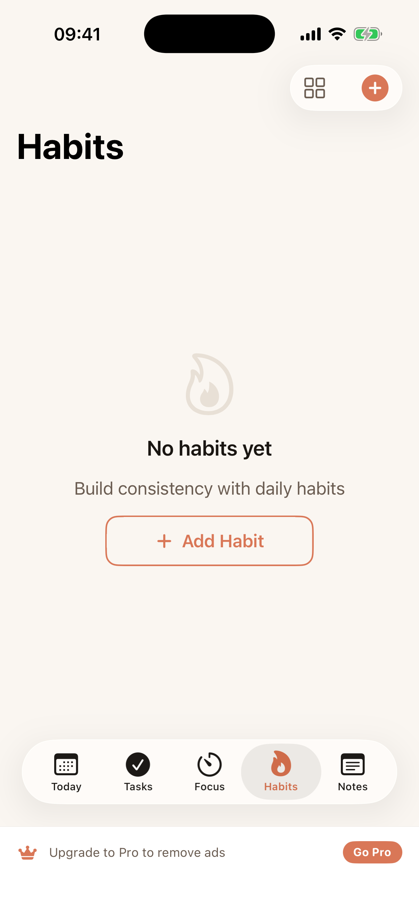
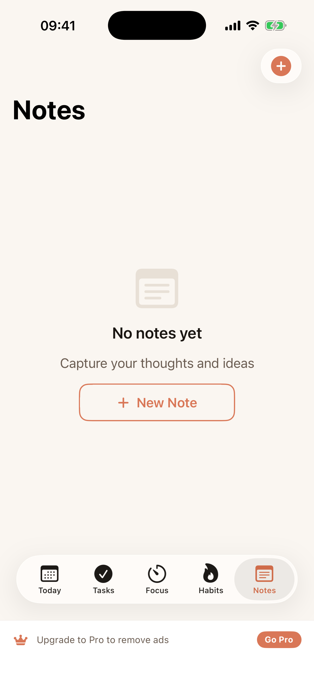

<p align="center">
  
</p>

<h1 align="center">Flo</h1>
<p align="center"><strong>Mindful Productivity for iOS & macOS</strong></p>

<p align="center">
  
  
  
  
  
  
</p>

---

## Screenshots

<p align="center">
  
  
  
  
  
</p>

---

## What is Flo?

Flo is a comprehensive productivity app that combines **task management**, **focus sessions**, **habit tracking**, **journaling**, and **AI-powered insights** into a single, beautifully designed experience. Built natively with SwiftUI and SwiftData for both iOS and macOS.

The name **Flo** comes from the concept of "flow state" — that moment of complete immersion in your work where productivity feels effortless.

---

## Features

### Daily Planner
- **Morning greeting** with personalized dashboard
- **Quick action buttons** — AI, Check-in, Review, Export, Profile
- **Today's overview** — tasks completed, habits done, focus time
- **Daily productivity tips** that rotate each day
- **Streak tracking** across all habits

### Task Management
- **Multiple view modes**: List, Kanban Board, Eisenhower Matrix, Calendar, Smart Lists
- **Priority levels** — High, Medium, Low with color coding
- **Subtasks** for breaking down complex work
- **Projects & Tags** for organization
- **Task templates** for recurring workflows
- **Recurrence** — daily, weekdays, weekly, biweekly, monthly
- **Kanban drag-and-drop** — To Do, In Progress, Done
- **Eisenhower Matrix** — Do First, Schedule, Delegate, Eliminate
- **Smart Lists** with dynamic filtering
- **Task statistics** and completion analytics

### Focus Timer
- **Pomodoro-style** sessions — 15, 25, 50, or 90 minutes
- **Custom presets** with saved configurations
- **Ambient sounds** — Rain, Ocean, Forest, Cafe, Fireplace, White Noise, Lo-Fi, Thunder
- **Session history** and detailed reports
- **Focus statistics** — streaks, total hours, completion rates
- **Notification** when session completes

### Habit Tracking
- **Daily habits** with streak counting
- **Habit categories** — Health, Mind, Productivity, Social, Creativity
- **Customizable icons & colors** for each habit
- **Streak freeze** protection
- **Completion heat map** by day of week
- **Best streak** tracking

### Notes
- **Rich text notes** with folders
- **Pin & favorite** important notes
- **Templates** — Meeting Notes, Daily Journal, Project Brief, Brainstorm, Reading Notes
- **Word count & reading time** tracking
- **Nested folder** organization
- **Auto-focus** title field on new notes
- **Smart cancel** — empty notes auto-delete on dismiss

### Live Activities
- **Dynamic Island** — compact and expanded views during focus sessions
- **Lock Screen** — real-time progress with circular timer and countdown
- **Pause/resume** state reflected in real-time
- **Task name** displayed when linked to a task

### Apple Calendar Integration
- **Automatic habit events** — habits added to Apple Calendar with recurrence
- **Smart scheduling** — respects daily, weekdays, weekends frequency
- **Reminder notifications** — local notifications at your chosen time
- **EventKit** powered — seamless native calendar integration

### AI Features (50+ AI-Powered Capabilities)
Powered by **Groq API** for ultra-fast inference:

- **AI Daily Briefing** — personalized morning summary
- **Smart Task Suggestions** — AI recommends what to work on
- **Task Prioritization** — automatic urgency/importance scoring
- **Focus Session Insights** — personalized productivity tips
- **Habit Coaching** — AI-driven streak advice
- **Mood Analysis** — pattern detection in mood entries
- **Journal Prompts** — AI-generated reflection questions
- **AI Assistant Chat** — ask anything about your productivity
- **Weekly Reviews** — AI-generated performance summaries
- **Energy Optimization** — suggestions based on your patterns
- And 40+ more features accessible from the AI Features Hub

### Mindful Planning
- **Morning Check-in** — set mood, energy, top priorities
- **Evening Review** — reflect on the day, rate productivity
- **Journaling** with guided prompts
- **Mood tracking** with emoji scale (1-5)
- **Productivity Score** — daily score across tasks, habits, and focus

### Cloud Sync (Pro)
- **Supabase-powered** real-time sync
- **Apple Sign In** authentication
- **Email/password** authentication
- **Cross-device** data synchronization
- **Conflict resolution** for offline changes

### Monetization
- **Free tier** with ads (AdMob banner)
- **Pro Monthly** — $4.99/month
- **Pro Yearly** — $29.99/year (save 50%)
- **Pro features**: Remove ads, Cloud Sync, AI features, all view modes
- **StoreKit 2** subscription management
- **Paywall** with feature comparison

### Additional Features
- **Global Search** — search across tasks, notes, and habits
- **What's New** screen with feature highlights
- **App Icon Chooser** — 6 icon styles
- **Theme Picker** — Light, Dark, System + 8 accent colors
- **Advanced Statistics** — detailed analytics dashboard
- **Notification Manager** — morning/evening reminders, habit alerts, task due dates
- **Haptic Feedback** throughout the app
- **Home Screen Quick Actions** (3D Touch) — New Task, Start Focus, Habits, AI
- **Keyboard Shortcuts** for macOS
- **Data Export** functionality
- **5-page animated onboarding** with integrated paywall
- **Live Activities** — Dynamic Island + Lock Screen for focus timer
- **Apple Calendar sync** for habits via EventKit

---

## Architecture

```
Flo/
├── FloApp.swift                    # App entry point, ModelContainer setup
├── Models/                         # SwiftData models
│   ├── TaskItem.swift              # Tasks with subtasks, projects, tags
│   ├── Project.swift               # Project grouping
│   ├── Tag.swift                   # Tag system
│   ├── Note.swift & NoteFolder     # Notes with folders
│   ├── Habit.swift                 # Habits with completions
│   ├── FocusSession.swift          # Focus session records
│   ├── FocusPreset.swift           # Saved focus configurations
│   ├── MoodEntry.swift             # Mood & energy tracking
│   ├── JournalEntry.swift          # Journal entries
│   ├── DailyScore.swift            # Productivity scores
│   ├── SmartList.swift             # Dynamic list filters
│   └── Enums.swift                 # Shared enums
├── Views/
│   ├── ContentView.swift           # Root view with tab bar
│   ├── Planner/                    # Daily planner, weekly, morning/evening
│   ├── Tasks/                      # List, Kanban, Matrix, Calendar, Smart Lists
│   ├── Focus/                      # Timer, presets, history, reports, ambient
│   ├── Habits/                     # Habit list, categories
│   ├── Notes/                      # Notes list with folders
│   ├── AI/                         # AI assistant, briefing, features hub
│   ├── Journal/                    # Journal entries
│   ├── Auth/                       # Login, profile
│   ├── Onboarding/                 # 5-page animated onboarding
│   ├── Paywall/                    # Subscription paywall
│   ├── Search/                     # Global search
│   └── Settings/                   # Settings, theme, stats, what's new
├── ViewModels/                     # MVVM view models
│   ├── TaskViewModel.swift
│   ├── FocusViewModel.swift
│   ├── HabitViewModel.swift
│   ├── NotesViewModel.swift
│   └── OnboardingViewModel.swift
├── Services/
│   ├── FloAIService.swift          # Groq API integration (50+ features)
│   ├── StoreKitManager.swift       # StoreKit 2 subscriptions
│   ├── SupabaseManager.swift       # Auth + cloud sync
│   ├── SyncService.swift           # Real-time data sync
│   ├── AdManager.swift             # AdMob integration
│   ├── NotificationManager.swift   # Local notifications
│   ├── HapticManager.swift         # Haptic feedback
│   ├── CalendarService.swift        # EventKit calendar integration
│   ├── LiveActivityManager.swift    # Dynamic Island / Lock Screen
│   ├── QuickActionsManager.swift   # Home screen shortcuts
│   └── WidgetDataService.swift     # Widget data provider
├── LiveActivity/
│   └── FocusLiveActivity.swift     # ActivityKit attributes & widgets
└── DesignSystem/
    ├── FloColors.swift             # Color palette + themes
    ├── FloTypography.swift         # Typography scale
    ├── FloAnimations.swift         # Animation presets
    ├── FloEmptyState.swift         # Empty states, streak badge, tips
    ├── LiquidGlass.swift           # Glass morphism effects
    └── Components/
        ├── FloButton.swift         # Custom buttons
        ├── FloCard.swift           # Card components
        ├── FloTextField.swift      # Custom text fields
        └── FloProgressRing.swift   # Circular progress
```

### Tech Stack
| Component | Technology |
|-----------|-----------|
| **UI Framework** | SwiftUI 6 |
| **Data Persistence** | SwiftData |
| **Concurrency** | Swift 6 strict concurrency |
| **AI Backend** | Groq API (Llama 3) |
| **Authentication** | Supabase Auth + Apple Sign In |
| **Cloud Sync** | Supabase Realtime |
| **Monetization** | StoreKit 2 |
| **Ads** | Google AdMob |
| **Notifications** | UserNotifications |
| **Live Activities** | ActivityKit |
| **Calendar** | EventKit |
| **Project Gen** | XcodeGen |
| **Platforms** | iOS 26+ / macOS 26+ |

---

## Getting Started

### Prerequisites
- **Xcode 26** or later
- **XcodeGen** (`brew install xcodegen`)
- iOS 26+ Simulator or device
- (Optional) Groq API key for AI features

### Setup

```bash
# Clone the repository
git clone https://github.com/SoldergG/Flo.git
cd Flo

# Generate Xcode project
xcodegen generate

# Open in Xcode
open Flo.xcodeproj
```

### Configuration

#### AI Features
To enable AI features, add your Groq API key in the app:
1. Go to **Settings > AI Settings**
2. Enter your Groq API key
3. Get a free key at [console.groq.com](https://console.groq.com)

#### Supabase (Cloud Sync)
The app comes pre-configured with a Supabase project. To use your own:
1. Create a project at [supabase.com](https://supabase.com)
2. Update the URL and anon key in `SupabaseManager.swift`

---

## Build

```bash
# Generate project
xcodegen generate

# Build for iOS Simulator
xcodebuild -project Flo.xcodeproj \
  -scheme Flo_iOS \
  -destination 'platform=iOS Simulator,name=iPhone 17 Pro' \
  build

# Build for macOS
xcodebuild -project Flo.xcodeproj \
  -scheme Flo_macOS \
  build
```

---

## Design System

Flo uses a warm **terracotta-inspired** design language:

| Token | Hex | Usage |
|-------|-----|-------|
| **Accent** | `#D97757` | Primary actions, active states |
| **Accent Secondary** | `#B8602E` | Secondary emphasis |
| **Background** | `#FAF6F1` | Page backgrounds |
| **Surface** | `#FFFFFF` | Cards, elevated elements |
| **Text Primary** | `#1A1612` | Main text |
| **Text Secondary** | `#6B5D52` | Supporting text |
| **Success** | `#5BA37C` | Completions, positive |
| **Warning** | `#E5A84B` | Streaks, caution |
| **Error** | `#D94F4F` | Overdue, destructive |

Typography uses SF Pro with a clean scale from caption (11pt) to large title (34pt), with special fonts for timers and stats using rounded design.

---

## License

This project is available under the MIT License. See [LICENSE](LICENSE) for details.

---

<p align="center">
  <strong>Built with SwiftUI & SwiftData</strong><br>
  <sub>Designed for mindful productivity</sub>
</p>
